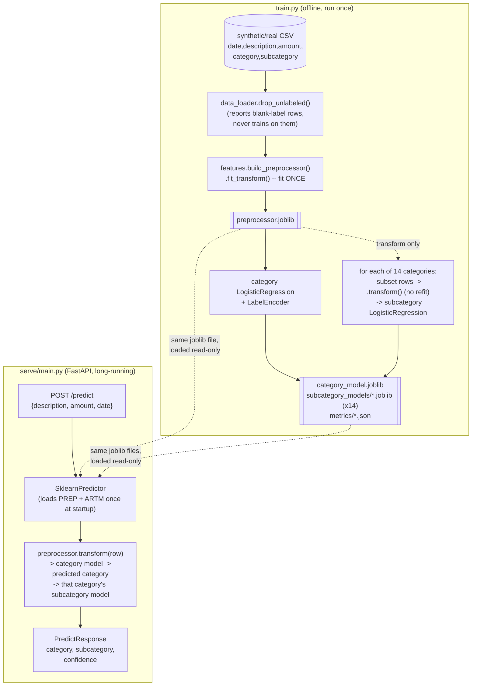

# Personal Finance Transaction Classifier — Implementation Plan

## Context

The user wants to learn the full supervised-ML pipeline (not just get a working
black box) for classifying personal finance transactions into a fixed taxonomy
of 14 categories / 71 subcategories (defined verbatim in `starting-prompt.md`,
verified by direct count: 6+5+7+6+6+7+5+5+5+4+3+5+4+3 = 71). The repo is
currently empty (only `starting-prompt.md`). Priorities, in order:

1. A shared preprocessing module used identically by training and serving, so
   there is no train/serve skew — this is the central teaching point.
2. A two-level classifier: one category model, then one independently-trained
   subcategory model per category (14 subcategory models total).
3. A model/serving boundary (a `Predictor` interface) designed so the sklearn
   baseline can later be swapped for a transformer (DistilBERT/FinBERT) without
   touching `serve/main.py`.
4. Validate everything on synthetic data first — real data (CSV: date,
   description, amount, category, subcategory) will be plugged in later once
   the pipeline is proven out.

Confirmed with the user directly:
- Real data will eventually be a CSV with `date, description, amount, category,
  subcategory` columns.
- Subcategory modeling = one classifier per top-level category (not a single
  global subcategory model conditioned on category).
- Rows with missing category/subcategory are **dropped from training**
  entirely — "Unknown" is never a class the model learns to predict; per
  `starting-prompt.md`'s own instruction ("note it as Unknown in the label
  output"), Unknown only ever describes raw input data with a blank label, for
  reporting purposes.

## Locked-in design decisions

- **Baseline model**: `TfidfVectorizer(analyzer="char_wb", ngram_range=(3,5))`
  for description text (char n-grams handle noisy merchant strings like store
  numbers better than word tokens) + `LogisticRegression` (not `LinearSVC`,
  because the API needs calibrated `predict_proba` for a confidence score).
- **Day-of-week** is derived *inside* the persisted preprocessing pipeline
  (via a small custom sklearn transformer that parses `date`), not computed
  separately by train/serve call sites — this is what makes "one artifact,
  reused everywhere" possible instead of relying on two code paths staying in
  sync by discipline.
- **No-skew mechanism**: exactly one `ColumnTransformer` is fit once in
  `train.py`, then `joblib.dump`ed as its own artifact (`preprocessor.joblib`).
  Every other consumer (subcategory training loop, evaluate.py, the serving
  Predictor) loads it and only calls `.transform()`, never refits or
  reconstructs it from scratch.
- **Confidence** = `P(category) * P(subcategory | predicted category)`, the
  product of the two independently-trained models' top-class probabilities.
  Flagged explicitly to the user as a reasonable but not rigorously calibrated
  joint probability.
- **Predictor abstraction**: `serve/main.py` depends only on a `Predictor`
  Protocol (`predict(description, amount, date) -> PredictionResult`,
  `health_check()`), implemented today by `SklearnPredictor`. A future
  `TransformerPredictor` implementing the same contract swaps in with a
  one-line change in `serve/main.py`'s startup, no endpoint/schema changes.

## Architecture: shared-artifact flow (the no-skew mechanism)



The key property the diagram is meant to make checkable: **training fits the
`ColumnTransformer` exactly once**, and every downstream consumer (the 14
subcategory fits, `evaluate.py`, and `SklearnPredictor` at serve time) only
ever calls `.transform()` on the already-fit object loaded from
`preprocessor.joblib`. There is no second `ColumnTransformer` construction
anywhere in the codebase — that's what rules out train/serve skew by
construction rather than by convention.

## File layout

```
txclassifier/
├── starting-prompt.md
├── requirements.txt
├── .gitignore                        # excludes data/raw/*.csv and models/*.joblib
├── data/
│   ├── raw/.gitkeep                  # future home for the real CSV
│   └── synthetic/synthetic_transactions.csv   # generated, not hand-written
├── src/
│   ├── __init__.py
│   ├── config.py                     # paths, hyperparameters, random seed
│   ├── taxonomy.py                   # CATEGORIES dict transcribed verbatim from starting-prompt.md + slugify_category()
│   ├── data_loader.py                # CSV loading + drop_unlabeled() + label_or_unknown() reporting helper
│   ├── synthetic_data.py             # synthetic dataset generator (script + importable function)
│   ├── features.py                   # build_preprocessor() — the shared ColumnTransformer + DayOfWeekExtractor
│   ├── predictor.py                  # Predictor Protocol, PredictionResult, SklearnPredictor
│   ├── train.py                      # trains category model + 14 subcategory models, saves artifacts + metrics
│   ├── evaluate.py                   # evaluate_classifier()/print/save + print_drop_report()
│   └── predict_cli.py                # tiny CLI for manual sanity-checking predictions pre-FastAPI
├── serve/
│   ├── __init__.py
│   ├── schemas.py                    # PredictRequest/PredictResponse/HealthResponse pydantic models
│   └── main.py                       # FastAPI app; lifespan loads SklearnPredictor once; /predict, /health
└── models/                            # entirely generated by train.py, gitignored
    ├── preprocessor.joblib
    ├── category_model.joblib + category_label_encoder.joblib
    ├── subcategory_models/<slug>_model.joblib + <slug>_label_encoder.joblib   (14 pairs)
    ├── metrics/category.json + subcategory_<slug>.json (x14)
    └── metadata.json                 # timestamp, sklearn version, row/drop counts, taxonomy checksum
```

`requirements.txt`: `pandas`, `scikit-learn`, `fastapi`, `uvicorn[standard]`,
`pydantic`, `joblib`, `numpy`. None of these are pre-installed in this
environment. Environment setup uses `uv` (already installed, `0.8.17`) instead
of raw `pip`/`venv`:
```
uv venv                              # creates .venv
uv pip install -r requirements.txt   # installs into .venv
```
All subsequent commands in this plan (`python -m src.train`, `uvicorn ...`,
`predict_cli.py`) run via `uv run <cmd>` (e.g. `uv run python -m src.train`)
so they execute inside `.venv` without a manual `source .venv/bin/activate`
step. Add `.venv/` to `.gitignore` alongside the existing exclusions.

## Key module designs

**`src/features.py`** — `build_preprocessor()` returns a `ColumnTransformer`
combining: TF-IDF char n-grams on `description`; `SimpleImputer` +
`StandardScaler` on `amount`; a custom `DayOfWeekExtractor` (parses `date` via
`pd.to_datetime`) piped into `OneHotEncoder(handle_unknown="ignore")`.

**`src/data_loader.py`** — `load_raw_transactions(path)` reads the CSV
untouched. `drop_unlabeled(df)` filters rows with blank/null category or
subcategory and returns `(clean_df, drop_report)` where the report has total
rows, dropped counts broken down by category, and rows kept. This drop path is
the *only* thing that touches label cleanliness for training; a separate
`label_or_unknown()` helper is for reporting/display only and never feeds
`.fit()`.

**`src/train.py`** flow: load → `drop_unlabeled` (print report) → stratified
80/20 split → fit preprocessor once, dump it → train category
`LogisticRegression` + `LabelEncoder` (with an assertion that learned classes
⊆ `taxonomy.CATEGORIES`) → loop over `taxonomy.CATEGORIES` (not over data, so
an empty category is reported as skipped, not silently missing), transform
each category's subset with the *already-fit* preprocessor, train that
category's subcategory `LogisticRegression`, save model+encoder+metrics → dump
`metadata.json`.

**`src/predictor.py`** — `PredictionResult` dataclass (category, subcategory,
confidence, category_confidence, subcategory_confidence). `Predictor` Protocol
defines the swap boundary. `SklearnPredictor.__init__` eagerly loads the
preprocessor, category model+encoder, and all 14 subcategory model+encoder
pairs from `models/`. `.predict()` builds a one-row DataFrame, transforms it
once, gets category via `predict_proba`, routes to that category's
subcategory model, returns `PredictionResult`.

**`src/evaluate.py`** — one generic `evaluate_classifier(y_true, y_pred,
label_names, model_name)` using `sklearn.metrics.classification_report` +
`confusion_matrix`, called once for the category model and once per
subcategory model. `print_drop_report()` surfaces dropped-row counts per
category from `data_loader.drop_unlabeled`.

**`src/synthetic_data.py`** — `generate_synthetic_dataset(n_per_subcategory=30,
seed=42)`, driven directly by `taxonomy.CATEGORIES` so it can't drift out of
sync. Per subcategory: 5–10 realistic merchant string templates + a plausible
amount distribution, random date (day-of-week derived from it, not sampled
independently). Deliberately injects ~20–30 blank-label rows so the drop-report
path is exercised from the first run. Includes a stratified-split guard
(fallback to non-stratified with a warning if any class is too small for
`stratify=`).

**`serve/main.py`** — FastAPI app using a `lifespan` context manager (not the
deprecated `@app.on_event("startup")`) to construct `SklearnPredictor` exactly
once when the process starts. `/predict` calls `predictor.predict(...)` and
returns a `PredictResponse`. `/health` calls `predictor.health_check()`. Run
via `uv run uvicorn serve.main:app --reload --port 8000` from repo root (so
`src`/`serve` imports resolve without an install step).

## Build order (milestones)

0. Scaffold dirs, `requirements.txt`, `config.py`, `taxonomy.py` (self-check:
   14 categories / 71 subcategories), `uv venv && uv pip install -r requirements.txt`.
1. `synthetic_data.py` produces `data/synthetic/synthetic_transactions.csv`.
2. `data_loader.py` drop/report logic.
3. `features.py` preprocessing pipeline, sanity-transform a sample.
4. `train.py` + `evaluate.py`: full training run producing all artifacts and
   metrics.
5. **Gate**: `predictor.py` + `predict_cli.py` — manually eyeball predictions
   on hand-picked descriptions across several categories before writing any
   FastAPI code.
6. Iterate on features/model based on Milestone 5 + confusion matrices.
7. `serve/schemas.py` + `serve/main.py` wired to the `Predictor` abstraction.
8. (Later, separate session) Point `config.py` at the real CSV, rerun
   `train.py` unchanged; flag any real subcategories with too few rows as an
   open decision rather than solving it now.

## Verification

All commands run through `uv run` so they execute inside `.venv`.

- M0: `uv run python -c "from src import taxonomy; print(len(taxonomy.CATEGORIES), sum(len(v) for v in taxonomy.CATEGORIES.values()))"` → expect `14 71`.
- M1: run the generator, inspect with `pandas.read_csv(...).sample(10)` and `.value_counts()` — confirm columns and roughly even class counts, plus some blank-label rows.
- M2: run `drop_unlabeled` on the synthetic CSV, confirm reported drop counts match injected blanks.
- M3: `build_preprocessor().fit_transform(sample_df)` — check shape, 7 one-hot weekday columns, no NaNs.
- M4: `uv run python -m src.train` — eyeball drop report, per-class precision/recall, mostly-diagonal confusion matrices; confirm `models/` has the preprocessor, category model+encoder, 28 subcategory files, metrics JSONs, metadata.
- M5: `uv run python -m src.predict_cli` on 5–10 examples spanning categories (e.g. `"STARBUCKS #4521", 5.75` → Food & Dining / Coffee shops) — confirm sane before proceeding.
- M6: re-run training after tweaks, diff metrics JSONs, check confusion-matrix off-diagonals for systematic confusions (e.g. Fast food vs. Dining out).
- M7: `uv run uvicorn serve.main:app --reload`, then `curl /health`, `curl -X POST /predict ...`, and check `/docs`.
- M8: rerun `train.py` against the real CSV with only a config path change.